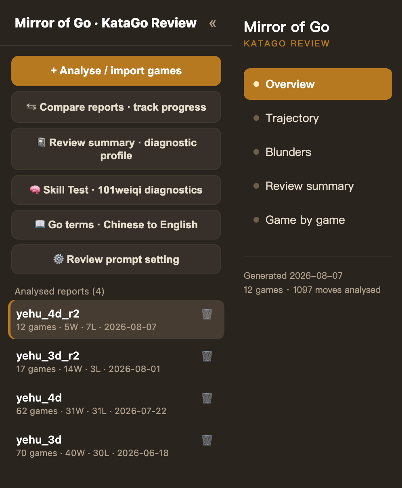
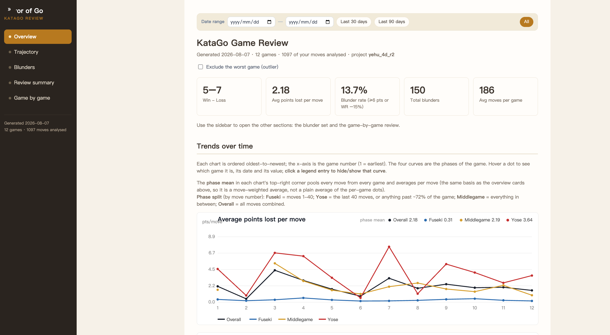
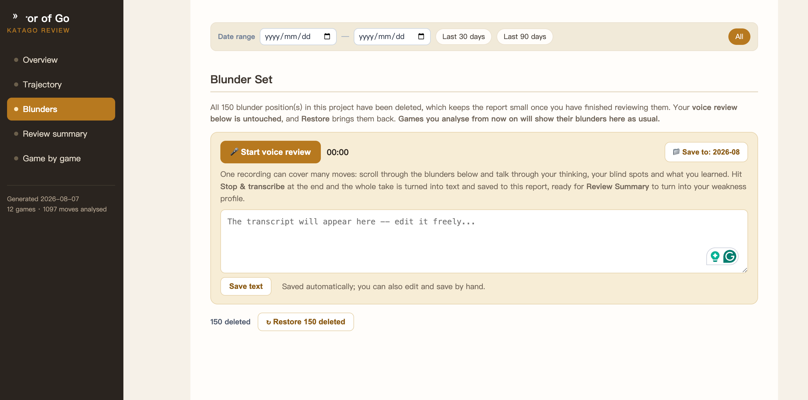
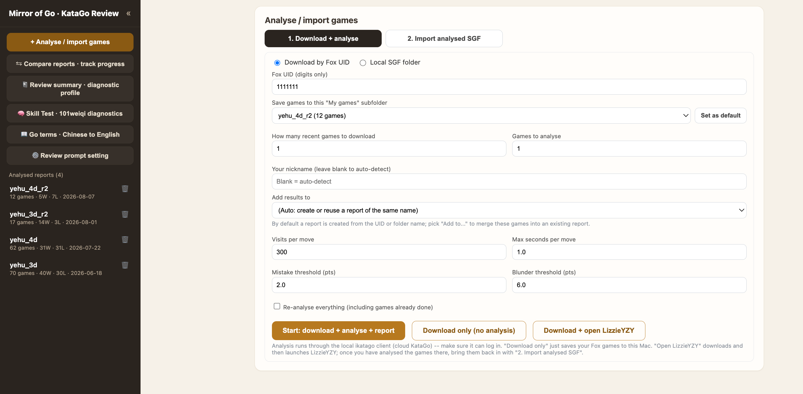

# 一目弈镜 · 对局复盘 — Yimuyijing Go Review

> 把你的野狐 / LizzieYZY 对局，一键变成 KataGo 级别的复盘报告：胜负曲线、每手损失目数、大错集、终局形势估计、进步趋势——全部离线可看。
>
> Turn your Fox (野狐) / LizzieYZY games into a KataGo‑powered review: win‑rate curves, points‑lost‑per‑move, a blunder gallery, endgame territory estimates, and an improvement trend — all viewable offline.

<p align="center">
  
</p>

---

## 它解决什么问题 · Why

很多业余棋手能用 KataGo / LizzieYZY 分析单局，却很难看清**自己长期的棋力变化和反复犯的错误**。一目弈镜把多局对局聚合成一份可浏览的报告，告诉你：钱该花在哪——是布局、中盘还是官子，是某一类反复出现的漏招，还是最近到底有没有进步。

Amateurs can analyze a single game in KataGo, but rarely see their *long‑term* patterns. Yimuyijing aggregates many games into one browsable report that answers: where are you bleeding points, which mistakes recur, and are you actually improving?

## ✨ 功能 · Features

- **两种来源**：输入野狐 UID 自动下载并用云 KataGo（ikatago）分析；或直接**导入 LizzieYZY「已分析」SGF**（纯 Python 解析，无需再跑引擎）。
- **本地网页应用**：左侧栏列出全部报告（可删除、可折叠），右侧查看；支持「仅下载」「分析结果归入已有报告」「下载到指定文件夹」。
- **丰富的报告**：概览卡片、随时间的变化趋势（每手损失 / 大错率 / 每局大错数）、失误集（含相同漏招聚类）、逐局回顾、终局形势（目数）估计。
- **大错定义**：损失 ≥ 6 目 **或** 胜率下降 ≥ 15%。
- **进步趋势**：对比最近 N 局与之前 N 局的「每手平均损失目数」，给出 进步 / 持平 / 退步。
- **语音复盘**：边翻大错集边讲，一次录音覆盖多个局面；用本机 whisper 转写（音频不出本机），可自选保存文件夹。
- **AI 诊断小结**：把语音笔记 + 报告数据交给 DeepSeek，自动**从笔记中归纳**你的弱点主题并给出练习清单；历次小结全部留档，互不覆盖。系统提示词可在侧栏直接编辑。
- **离线静态页**：自动生成 `index.html`，关掉程序也能浏览全部报告。
- **零第三方依赖**：纯 Python 标准库（分析功能需要本机 ikatago；语音转写需 faster-whisper）。

Beyond the report itself: **voice review** (talk your way through the blunder set in one
take, transcribed locally by whisper, filed into a folder you choose), and an **AI
diagnostic summary** that reads those notes plus the report's own numbers and names the
weakness themes it finds in them — with every past version kept, and the system prompt
editable from the sidebar.

<p align="center">
  
</p>

<p align="center">
  <em>概览页：五张汇总卡片，以及按阶段（布局 / 中盘 / 官子）拆开的趋势图。<br>
  Overview: the summary cards, and trends split by phase — fuseki, middlegame, yose.</em>
</p>

<p align="center">
  
</p>

<p align="center">
  <em>大错集顶部的语音复盘：一次录音讲完多个局面，右上角可改音频保存位置。<br>
  Voice review, at the top of the Blunder Set: one take covers many positions, and the
  button on the right chooses where the audio is filed.</em>
</p>

## 🚀 快速开始 · Quickstart

**只想看看效果？** 直接打开 [`go_review/demo/review_report.html`](go_review/demo/review_report.html) —— 这是一份内置的示例报告（AlphaGo 对局），零配置即可浏览。

**完整使用：**

1. 安装 Python 3（macOS 自带或从 python.org 安装）。
2. 配置 ikatago（云 KataGo）凭据 —— 见下方「凭据」。
3. 启动：
   - macOS：双击仓库根目录的 **`一目弈镜.command`**，浏览器会自动打开 `http://127.0.0.1:8765`；
   - 或命令行：`python3 go_review/web_app.py`
4. 在「① 下载 + 分析」里填野狐 UID 开跑，或在「② 导入已分析 SGF」拖入 LizzieYZY 的已分析棋谱。

> 分析依赖本机的 ikatago。导入 LizzieYZY 已分析 SGF **不需要**引擎。

<p align="center">
  
</p>

<p align="center">
  <em>第 4 步长这样：左侧是全部报告与各个工具页，右侧填 UID 与分析参数。<br>
  Step 4: reports and tool pages on the left, UID and analysis settings on the right.</em>
</p>

## 🔑 凭据 · Credentials

**不要把账号密码提交到 git。** 真正的设置放在 `go_review/config.json`（已被 `.gitignore` 忽略，仅存于本机）。仓库里只有模板 `go_review/config.example.json`。

首次使用，复制模板并填入你的 ikatago 路径/账号，或用环境变量：

```bash
cp go_review/config.example.json go_review/config.json
# 然后编辑 config.json，或：
export IKATAGO_USERNAME=你的账号
export IKATAGO_PASSWORD=你的密码
```

配置里字符串支持 `${ENV_VAR}` 与 `~` 展开，所以凭据可以只放在环境变量里、永不落盘。

## 🧠 工作原理 · How it works

```
野狐 UID ──下载──▶ SGF ──┐
                         ├─▶ KataGo(ikatago) 分析 ─┐
LizzieYZY 已分析 SGF ─────┘   (纯 Python 直接解析)   ├─▶ 每局 JSON ─▶ 聚合 ─▶ HTML 报告
                                                    ┘
```

- `sgfparse.py` 只取 SGF **主线**（分析谱里的分支变化不会被算进着手数）。
- `import_lizzie.py` 把 LizzieYZY 的 `LZ` / `LZOP` 内联分析解析成与引擎一致的 JSON：候选手、ownership、胜率（整数万分比，已正确归一化）。已落子的手从**落子后**的局面评估，与 LizzieYZY 自身的「差异手」吻合。
- `report/` 把所有每局 JSON 聚合成单页 HTML，附带可按日期筛选的交互图表；图表是手写 SVG，
  没有图表库。注意趋势图有两套渲染：构建时用 Python 画，改日期区间后用 JS 重画，两边必须一致。
- `webapp/` 是一个**纯标准库**的本地服务器（仪表盘 + 分析/导入面板 + 语音 + AI 小结 + 静态导出）。

## 🗂 项目结构 · Layout

```
go_review/
  run_review.py       命令行入口（--selfcheck 先空跑一遍）
  web_app.py          启动器（35 行），实际实现在 webapp/
  webapp/             本地网页应用：路由、任务、语音、AI 小结、静态导出
  report/             报告生成：聚合、手写 SVG 图表、棋盘、各分页
  pipeline.py         下载 → 写 config → 分析 → 报告 的串联
  analyze.py          调用 KataGo、生成每局 JSON
  import_lizzie.py    纯 Python 解析 LizzieYZY 已分析 SGF
  sgfparse.py         轻量 SGF 解析（仅主线）
  estimate_score.py   终局形势（目数）估计
  appconfig.py        安全的配置加载（env 展开 / 示例回退）
  prompts/            AI 小结的提示词（含你自己保存的覆盖版本）
  config.example.json 配置模板（无密钥）
  demo/               内置示例报告（可直接打开）
  tests/              解析核心的单元测试
  CLAUDE.md           逐模块说明与踩坑记录
一目弈镜.command       macOS 一键启动
```

> `report.py` 与 `web_app.py` 早已长到单文件读不动，因此拆成了 `report/` 和 `webapp/`
> 两个包；`web_app.py` 保留为启动器，旧命令照常可用。
> `report.py` and `web_app.py` outgrew being single files and were split into packages;
> `web_app.py` remains as a launcher so the old command still works.

## 🧩 仓库里的另外两个工具 · Also in this repo

同一台机器上的两个小工具，与复盘互补：

- **`tsumego/`** — 101weiqi **段位测试**诊断。把你的做题记录变成一份「你是*怎么*错的」的报告：
  用网站缓存的**大众着法树**把每次失手分成 **陷阱**（大量人同踩的错着）、**读不到底**
  （走对了前几手就停了）、**书外**（几乎没人下的手），三者需要完全不同的训练。
  另有 `python3 -m tsumego explain <Q>`，逐手讲清一道题在第几手真正分胜负。
- **`workdesk/`** — 本地应用启动台。打开一个页面，每个应用一张卡片：启动、打开、停止、看日志，
  不用再开终端。

**`tsumego/`** turns your 101weiqi Skill Test history into a diagnosis of *how* you get
problems wrong — traps, ran out of reading, or off-book, which need different training —
and `python3 -m tsumego explain <Q>` walks one problem move by move to the point where it
is actually decided. **`workdesk/`** is a page with one card per local app: Launch, Open,
Stop, log. Each has its own README.

## ✅ 测试 · Tests

```bash
python3 go_review/tests/test_parsing.py     # 或：python3 -m pytest go_review/tests
python3 -m pytest tsumego/tests             # 失误分类 + explain
python3 workdesk/tests/test_stop.py         # 停止/信号的安全边界（脚本，直接运行）
```

覆盖：胜率归一化、主线解析（忽略分支变化）、坐标转换、LZ 候选解析；做题失误的三类判定与
逐手讲解；以及启动台「停止」绝不误伤启动器本身或其祖先进程。

## 🛠 技术 · Tech

Python 3 标准库（`http.server`、`re`、`json` …），零 pip 依赖；前端为内联 HTML/CSS/JS（图表为手写 SVG）。分析后端为开源 [KataGo](https://github.com/lightvector/KataGo)，经 ikatago 云端调用。

## 📄 License

MIT — see [LICENSE](LICENSE).

## 🙏 致谢 · Acknowledgements

KataGo (lightvector)、LizzieYZF/LizzieYZY、野狐围棋。本项目与上述方均无官方关联。
